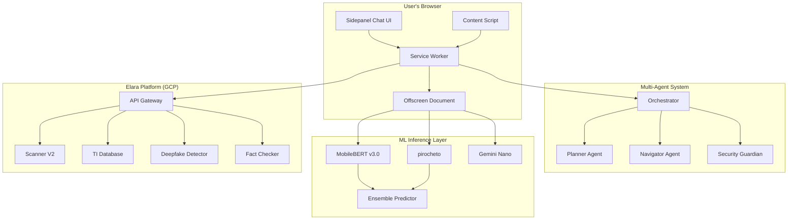
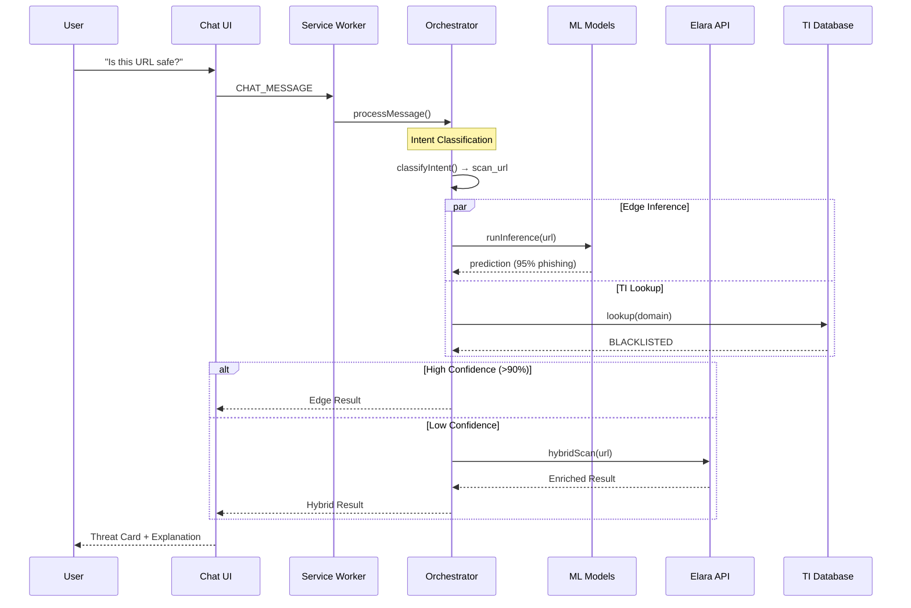
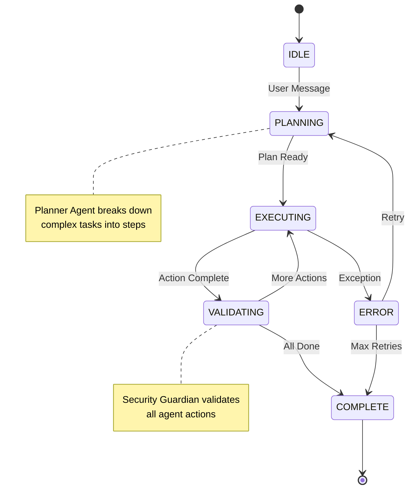
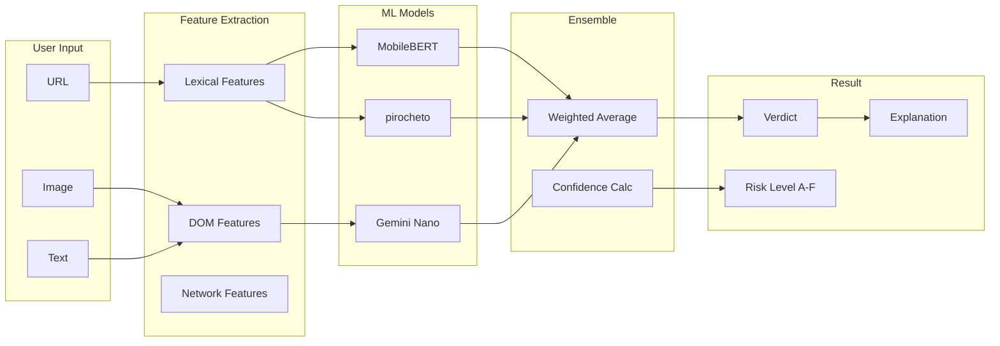
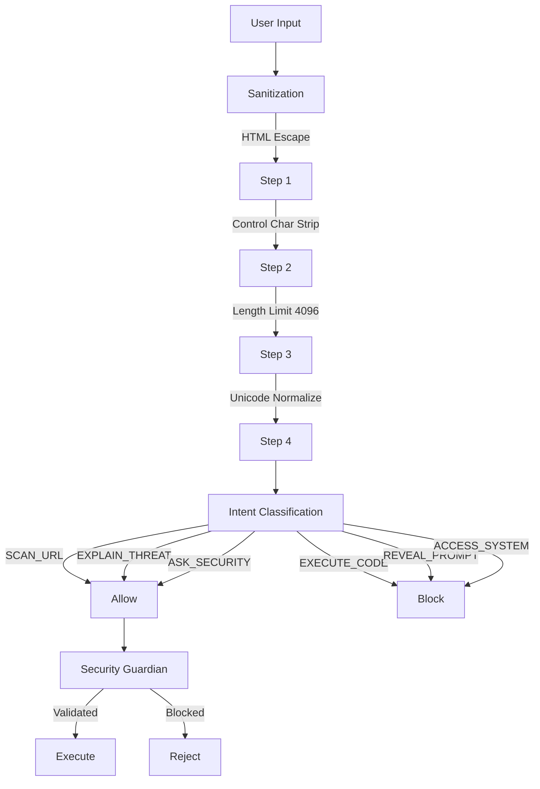
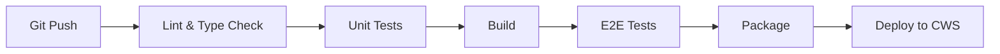

# Elara AI Agent

> **"Ask Elara"** - Enterprise Browser Security Intelligence Platform

[](https://chrome.google.com/webstore)
[](LICENSE)
[](https://www.typescriptlang.org/)
[](https://reactjs.org/)

Elara AI Agent is a GPT/KIMI-style conversational AI browser extension that provides real-time phishing detection, deepfake analysis, fact-checking, and cybersecurity coaching. Built with a multi-agent architecture inspired by [nanobrowser](https://github.com/anthropics/nanobrowser).

---

## Table of Contents

- [Features](#features)
- [Architecture](#architecture)
- [Quick Start](#quick-start)
- [Installation](#installation)
- [Usage](#usage)
- [API Integration](#api-integration)
- [Security](#security)
- [Development](#development)
- [Testing](#testing)
- [Deployment](#deployment)

---

## Features

### Core Capabilities

| Feature | Description | Latency |
|---------|-------------|---------|
| **URL Scanning** | Real-time phishing detection with 99.25% accuracy | <100ms (edge) |
| **Deep Scan** | Full Scanner V2 pipeline with 17 ML models | 10-30s |
| **Deepfake Detection** | AI-generated image/video analysis | ~5s |
| **Fact Checking** | Claim verification against trusted sources | ~3s |
| **TI Database Sync** | Real-time threat intelligence updates | Continuous |

### AI Chat Interface

```
+------------------------------------------------------------------+
|  [Shield Icon]  Ask Elara - Security Assistant        [Settings]  |
+------------------------------------------------------------------+
|                                                                    |
|  [ELARA] Hello! I'm Elara, your cybersecurity guardian.           |
|          I can scan URLs, detect phishing, analyze images for      |
|          deepfakes, and verify facts. How can I protect you?       |
|                                                                    |
|  [YOU] Is this link safe? https://paypa1-secure.com/login          |
|                                                                    |
|  [ELARA] Analyzing URL...                                          |
|                                                                    |
|  +--------------------------------------------------------------+  |
|  | THREAT DETECTED                           Risk: 98.5% [F]    |  |
|  |--------------------------------------------------------------|  |
|  | Type: Phishing (PayPal Impersonation)                        |  |
|  |                                                              |  |
|  | Indicators:                                                  |  |
|  | - Uses "1" instead of "l" (typosquatting)                   |  |
|  | - Domain registered 2 days ago                               |  |
|  | - SSL certificate mismatch                                   |  |
|  | - Known phishing pattern in TI database                      |  |
|  +--------------------------------------------------------------+  |
|                                                                    |
|  I strongly recommend NOT visiting this site.                      |
|                                                                    |
+------------------------------------------------------------------+
|  [Scan URL] [Check Image] [Fact Check] [Deep Scan] [Settings]      |
+------------------------------------------------------------------+
|  Type your question or paste a URL...              [Mic] [Send]    |
+------------------------------------------------------------------+
```

---

## Architecture

### System Overview



### Request Flow



### Multi-Agent Orchestration



### Data Flow



---

## Quick Start

```bash
# Clone the repository
git clone https://github.com/AuraOracle/elara-ai-agent.git
cd elara-ai-agent

# Install dependencies
pnpm install

# Build for development
pnpm build:dev

# Load in Chrome
# 1. Open chrome://extensions
# 2. Enable "Developer mode"
# 3. Click "Load unpacked"
# 4. Select the `dist` folder
```

---

## Installation

### Prerequisites

- Node.js 18+
- pnpm 8+
- Chrome 120+ (for Manifest V3 support)
- (Optional) Chrome 138+ for Gemini Nano

### Build Commands

```bash
# Development build with source maps
pnpm build:dev

# Production build (minified)
pnpm build:prod

# Watch mode
pnpm watch

# Type checking
pnpm typecheck

# Linting
pnpm lint

# Run tests
pnpm test
```

---

## Usage

### Chat Commands

| Command | Description | Example |
|---------|-------------|---------|
| **Scan URL** | Analyze URL for phishing | "Is this safe? https://example.com" |
| **Deep Scan** | Full 17-model analysis | "Deep scan https://suspicious.com" |
| **Check Image** | Deepfake detection | "Is this image real?" + upload |
| **Fact Check** | Verify claims | "Fact check: The earth is flat" |
| **Explain** | Security education | "What is typosquatting?" |

### Context Menu

Right-click on any:
- **Link** → "Scan link with Elara"
- **Page** → "Scan this page with Elara"
- **Selected text** → "Fact check with Elara"
- **Image** → "Check image for deepfake"

### Keyboard Shortcuts

| Shortcut | Action |
|----------|--------|
| `Ctrl+Shift+E` | Open Elara sidepanel |
| `Ctrl+Shift+S` | Quick scan current page |

---

## API Integration

### Elara Platform Endpoints

```
Base URL: https://dev-api.thiefdroppers.com/api/v2
```

| Endpoint | Method | Description |
|----------|--------|-------------|
| `/scanner/hybrid` | POST | Edge + TI enrichment |
| `/scanner/deep` | POST | Full Scanner V2 pipeline |
| `/detect/deepfake` | POST | Image/video analysis |
| `/factcheck/claim` | POST | Claim verification |
| `/ti/federated-sync` | GET | TI database updates |

### Request Example

```typescript
// Hybrid scan request
const response = await fetch('https://dev-api.thiefdroppers.com/api/v2/scanner/hybrid', {
  method: 'POST',
  headers: {
    'Content-Type': 'application/json',
    'Authorization': `Bearer ${token}`,
  },
  body: JSON.stringify({
    url: 'https://suspicious-site.com',
    features: extractedFeatures,
    options: { includeWhois: true },
  }),
});
```

---

## Security

### Double Encryption Protocol

```
+------------------------------------------------------------------+
|  LAYER 1: TLS 1.3 (Transport)                                     |
|  - Certificate pinning                                            |
|  - HSTS enforced                                                  |
+------------------------------------------------------------------+
                              |
                              v
+------------------------------------------------------------------+
|  LAYER 2: AES-256-GCM (Application)                               |
|  - HKDF key derivation                                            |
|  - 96-bit IV                                                      |
|  - Authentication tag                                             |
+------------------------------------------------------------------+
                              |
                              v
+------------------------------------------------------------------+
|  LAYER 3: Field-Level Encryption                                  |
|  - Sensitive fields encrypted                                     |
|  - HMAC signature                                                 |
+------------------------------------------------------------------+
```

### Prompt Injection Defense



---

## Development

### Project Structure

```
elara-ai-agent/
├── src/
│   ├── background/
│   │   ├── service-worker.ts      # Main service worker
│   │   ├── agents/
│   │   │   ├── orchestrator.ts    # Multi-agent coordinator
│   │   │   ├── planner-agent.ts   # Task planning
│   │   │   ├── navigator-agent.ts # DOM operations
│   │   │   └── security-agent.ts  # Security guardian
│   │   ├── services/
│   │   │   ├── scanner-client.ts  # API client
│   │   │   ├── ti-sync.ts         # TI database sync
│   │   │   └── model-manager.ts   # ONNX model lifecycle
│   │   └── crypto/
│   │       ├── encryption.ts      # AES-256-GCM
│   │       └── key-derivation.ts  # HKDF
│   │
│   ├── sidepanel/
│   │   ├── App.tsx                # React app root
│   │   ├── components/
│   │   │   ├── ChatInterface.tsx  # Main chat UI
│   │   │   ├── MessageBubble.tsx  # Chat messages
│   │   │   ├── ThreatCard.tsx     # Threat display
│   │   │   └── QuickActions.tsx   # Action buttons
│   │   ├── hooks/
│   │   │   ├── useChat.ts         # Chat state
│   │   │   └── useAgent.ts        # Agent communication
│   │   └── styles/
│   │       └── theme.css          # Dark theme
│   │
│   ├── content/
│   │   └── content-script.ts      # Page injection
│   │
│   ├── lib/
│   │   ├── ensemble-predictor.ts  # Model fusion
│   │   ├── feature-extractor.ts   # URL analysis
│   │   └── pattern-matcher.ts     # Heuristic patterns
│   │
│   ├── api/
│   │   └── scanner-client.ts      # Platform API
│   │
│   └── types/
│       └── index.ts               # TypeScript types
│
├── models/                        # ONNX models
├── public/                        # Static assets
├── docs/                          # Documentation
├── tests/                         # Test suites
└── dist/                          # Build output
```

### Path Aliases

```typescript
// tsconfig.json
{
  "paths": {
    "@/*": ["src/*"],
    "@background/*": ["src/background/*"],
    "@sidepanel/*": ["src/sidepanel/*"],
    "@lib/*": ["src/lib/*"],
    "@types/*": ["src/types/*"]
  }
}
```

---

## Testing

### Test Pyramid

```
                    /\
                   /  \
                  / E2E \          15 tests
                 / (Playwright) \
                /----------------\
               /   Integration    \    50 tests
              /    (API mocks)     \
             /----------------------\
            /        Unit Tests      \   200+ tests
           /         (Vitest)         \
          /----------------------------\
```

### Coverage Targets

| Component | Target | Current |
|-----------|--------|---------|
| Agent Orchestrator | 95% | - |
| Encryption Module | 100% | - |
| API Client | 90% | - |
| UI Components | 80% | - |
| **Overall** | **90%** | - |

### Running Tests

```bash
# Unit tests
pnpm test

# E2E tests
pnpm test:e2e

# Coverage report
pnpm test:coverage

# Security tests
pnpm test:security
```

---

## Deployment

### Chrome Web Store

```bash
# Create production build
pnpm build:prod

# Package for submission
pnpm package

# Output: elara-ai-agent-v1.0.0.zip
```

### CI/CD Pipeline



---

## License

Copyright (c) 2025 Thiefdroppers Inc. All rights reserved.

This software is proprietary and confidential. Unauthorized copying, distribution, or use is strictly prohibited.

---

## Credits

**Created by:**
- Tanmoy Sen (Thiefdroppers Inc.)
- Claude (Anthropic) - AI Co-Author

**Inspired by:**
- [nanobrowser](https://github.com/anthropics/nanobrowser) - Multi-agent browser architecture
- [chatscope](https://chatscope.io/) - Chat UI components

---

<p align="center">
  
  <br>
  <strong>Elara AI Agent</strong>
  <br>
  <em>Your Cybersecurity Guardian</em>
</p>
